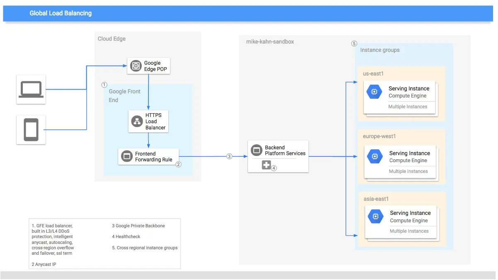

# Terraform-gcp-tutorial
https://www.udemy.com/course/terraform-for-beginners-using-google-cloud-platform-gcp/

<br/>

# Life cycle 

- ***create_before_destroy***

    By default, Terraform will instead destroy the existing object and then create a new replacement object with the new configured arguments. 
    
    The create_before_destroy meta-argument changes this behavior so that the new replacement object is created first, and the prior object is destroyed after the replacement is created.


- ***prevent_destroy***

    Reject with an error any plan that would destroy the infrastructure object associated with the resource, as long as the argument remains present in the configuration.

- ***ignore_changes***

    Intended to be used when a resource is created with references to data that may change in the future, but should not affect said resource after its creation.

- ***replace_triggered_by***

    Replaces the resource when any of the referenced items change.


    Replace `aws_appautoscaling_target` each time this instance of the aws_ecs_service is replaced.

    ```
    resource "aws_appautoscaling_target" "ecs_target" {

        lifecycle {
            replace_triggered_by = [
                aws_ecs_service.svc.id
            ]
        }
    }
    ```


# GCP login
1. username and password
     
     ```gcloud auth application-default login ```

2. google cloud shell
3. service account key

<br/>

# Networking
- VPC
    - VPC networks are logically isolated from each other in Google
Cloud.
    - VPC is a global resource & consist of subnets in one or more region
    - It is possible to control all the traffic which is coming in and going
outside a VPC 

<br> 

- VPC Subnets
    - Subnets are regional resources and have IP address
ranges associated with them
    - You create instances, containers, and the like in these subnets. When you create an instance, you must create it in a subnet, and the instance draws its internal IP address from that subnet.
    - Resources in public subnet CAN be accessed from
internet
    - Resources in private subnet CANNOT be accessed from
internet

<br> 

- CIDR (Classless Inter-Domain Routing) Blocks
    - CIDR blocks represent groups of IP addresses that have the same network prefixes and number of bits.
    - A CIDR block consist of a starting IP address (69.208.0.0) and a range (/28) 
    - Quick Tip: 69.208.0.0/28 shows that the first 28 bits out of 32 are fixed.  (Last 4 bits can change. 2 to power 4 = 16 addresses)
    - Best place to understand CIDR block: https://cidr.xyz/

<br> 

- GCP firewall
    - Each firewall rule has priority of (0-65535) assigned to it (0 has highest priority. 65525 has lowest priority)

    - ***Ingress Rules***: Incoming traffic from outside to GCP targets
        - Target (defines destination)
        - Source (defines where the traffic is coming from)

    <br/>
    
    - ***Egress Rules***: Outgoing traffic to destination from GCP targets
        - Target (defines the source)
        - Destination: CIDR Block
    
    <br/>

    - Firewall rule components:
        - Direction
        - Priority
        - Action on match
        - Target
        - Protocol

<br>

# GCP Load Balancer



 - create an instance template
 - create an instance group from the instance template (auto scaling settings)
 - create a load balancer (layer 4 & 7, set frontend, backend)

<br>

## Google Front End Service
 - intermediary gateway, router
 - make it available on the internet
 - TLS with certificates
 - DoS attacks protection

<br>


# Cloud Run
Cloud Run is a managed compute platform that lets you run containers directly on top of Google's scalable infrastructure. In order for your service or job to be deployable to Cloud Run, you must package it in a container image.

- ***Cloud Run services***: Used to run code that responds to web requests, or events.
    - trafic splitting per revisions (50% for revision-1 etc)
    
    <br>
    
- ***Cloud Run jobs***: Used to run code that performs work (a job) and quits when the work is done.
    - Scheduled job
    - Array job
    - Script or tool

    <br>

- ***Array jobs*** are a faster way to process jobs that can be split into multiple independent tasks. For example, if you are reading 1,000 images from Cloud Storage to resize and crop them, processing them consecutively will be slower than processing them all at the same time with many container instances.


<br>


# Terraform Commands

```
# help
terraform import -help

# auto approval
terraform apply -auto-approve    


# show resource under terraform management (after apply)
terraform state list
terraform state show [resource]

# remove resource from the tfstate
terraform state rm google_storage_bucket.bucketterraform2

```
terraform.tfstate file gets created after applying.


###  Basic commans
```
# run this in a folder with terraform files
terraform init

# validate
terraform validate

# format
terraform fmt

# execution simulate
terraform plan

# execute it
terraform apply
```

### import existing infrastructure
```
terraform import [options] ADDRESS ID


# main.tf
resource "aws_s3_bucket" "sample_bucket" {
    bucket = "sample-bucket"
}

# command
terraform import aws_s3_bucket.sample_bucket sample-bucket
```
sample-bucket will be added to ***tfstate*** and will be managed by terraform.


<br>

# Terraform Workspace
Workspaces in Terraform are simply independently managed state files. Terraform starts with a single, default workspace named default that you cannot delete. 

## Use Cases
Workspaces are convenient in a number of situations:

***Multiple Environments***: One common need in infrastructure management is to build multiple environments, with mostly the same setup but keeping a few variables different, like networking and sizing.
1. Production
2. Staging
3. Development

<br>

***Multiple Regions/Locations***: Replicate infrastructure in multiple places for High Availability (HA) and Disaster Recovery (DR).
1. us-east-1
2. eu-west-2

<br>

***Multiple Accounts/Subscriptions***: Create infrastructure in multiple accounts.
1. Cloud Account 1
2. Cloud Account 2

<br>

***Testing and Research***: Quickly create a new infrastructure for temporary pilot testing, freely experiment or R&D purpose, and destroy it with single command.

<br>

you may include the name of the current workspace using the `${terraform.workspace}`

```
resource "aws_instance" "example" {
  count = "${terraform.workspace == "default" ? 5 : 1}"

  # ... other arguments
}
```


## commands
```
# List Workspace
terraform workspace list

# Create new workspace
terraform workspace new <name>

# Show current workspace
terraform workspace show

# Switch Workspace
terraform workspace select <workspace name>

# Delete the Workspace
terraform workspace delete <workspace name>

```

## state management with workspace
If you create a new workspace, instead of terraform.tfstate.d file, it creates this folder structure

terraform.tfstate.d > [workspace name]

check tf_commands/terraform_workspace folder.

```
[dev]
terraform workspace new dev
terraform workspace select dev
terraform apply -var-file dev.tfvars -auto-approve
terraform destroy -var-file dev.tfvars -auto-approve

[stage]
terraform workspace new stage
terraform workspace select stage
terraform apply -var-file stage.tfvars -auto-approve
terraform destroy -var-file stage.tfvars -auto-approve
```